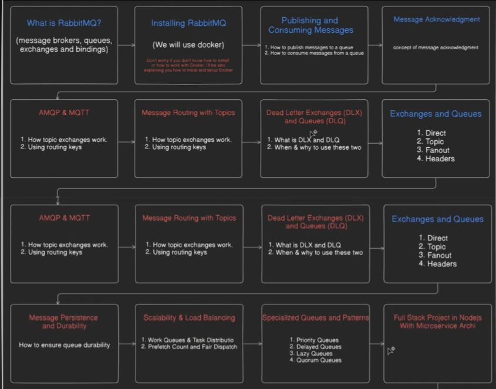

# RabbitMQ Notes

#### all from straight documentation

<div align="center">
	
	<br/>
	<em>Overview: What will be covered</em>
</div>

---

## Core Concepts

**RabbitMQ** is a message broker that enables communication between different parts of a system using messages. It decouples producers (senders) and consumers (receivers) via exchanges and queues.

| Term     | Analogy                             | Description                                                |
| -------- | ----------------------------------- | ---------------------------------------------------------- |
| Producer | The sender of the message           | Application/service that creates and sends messages        |
| Exchange | The post office                     | Receives messages from producers and routes them to queues |
| Queue    | The mailbox                         | Stores messages until they are processed by consumers      |
| Consumer | The person who picks up the message | Application/service that receives and processes messages   |

---

## How RabbitMQ Works

1. **Producer** sends a message to an **Exchange**.
2. **Exchange** uses bindings and routing keys to decide which **Queue(s)** should receive the message.
3. **Queue** stores the message until a **Consumer** retrieves it.

> **Binding:** A rule that links an exchange to a queue using a routing key. If a message arrives with a matching routing key, it is placed in the bound queue.

---

## Types of Exchanges

### 1. Direct Exchange

Direct Exchange delivers messages to queues based on an exact match between the message's routing key and the queue's binding key.

**Key Points:**

- Only queues bound with the exact same routing key receive the message.
- No partial matches, wildcards, or guessing.

**Example:**

```
Queue "Q1" bound with routing key "blue"
Message with routing key "blue" → goes to Q1
Message with routing key "red" → goes nowhere
```

**What problem does Direct Exchange solve?**
Direct exchange answers: “This message is for WHO exactly?”

- Not everyone.
- Not maybe someone.
- Exactly this queue.

**Summary:**

- ⚠️ No partial match
- ⚠️ No wildcards
- ⚠️ No guessing

---

### 2. Topic Exchange

Topic Exchange allows routing messages to one or many queues based on wildcard patterns in routing keys. This is useful for complex routing scenarios.

**Wildcards:**

- `*` (asterisk): matches exactly one word
- `#` (hash): matches zero or more words

**How it works:**

1. Producer sends a message to the topic exchange with a routing key (e.g., `order.placed`, `payment.pending`).
2. Queues are bound to the exchange with patterns (e.g., `order.*`, `payment.*`).
3. Exchange delivers messages to all queues whose binding pattern matches the routing key.

**Example in code:**

- Producer: `src/topic-exchange/prodcuer.ts` sends messages with different routing keys.
- Consumers: `src/topic-exchange/order-service.ts` and `src/topic-exchange/payment-service.ts` bind to patterns like `order.*` and `payment.*`.
- See `src/topic-exchange/consumer.ts` for the consumer logic.

**Benefits:**

- Flexible message routing using wildcards.
- Supports complex scenarios (e.g., logs, notifications, etc.).

---

### 3. Fanout Exchange

Fanout Exchange broadcasts messages to all queues bound to it, regardless of routing key. It is the simplest type of exchange and is used for scenarios where every consumer should receive every message (e.g., pub/sub, notifications, broadcasting events).

**Key Points:**
- Ignores routing keys completely.
- Every queue bound to the exchange receives a copy of every message.
- Great for broadcasting the same message to multiple consumers.

**How it works:**
1. Producer sends a message to the fanout exchange.
2. Exchange forwards the message to all bound queues.
3. All consumers listening to those queues receive the message.

**Example in code:**
- Producer: `src/fanout-exchnage/producer.ts`
- Consumer: `src/fanout-exchnage/consumer.ts`

**Benefits:**
- Simple and efficient for broadcast scenarios.
- No need to manage routing keys or patterns.

**Summary:**
> Use Fanout Exchange when you want to deliver every message to every consumer (e.g., real-time feeds, notifications, etc.).

---

## Common Questions

**Why do we create queues on the consumer side?**

> Where would we store the messages from the producer that the exchange sends? Right—in the queue! That's why consumers create queues.

---

work flow

```
Queue "Q1" bound with routing key "blue"
Message with routing key "blue" → goes to Q1
Message with routing key "red" → goes nowhere
```

# my dumb questions when i was learning

why do we create queues on consumer side
-> where would we store the messages from producer that exchange sends ? right in queue thats why we create those
